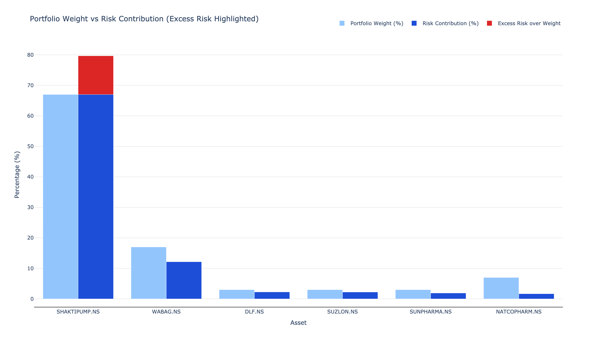
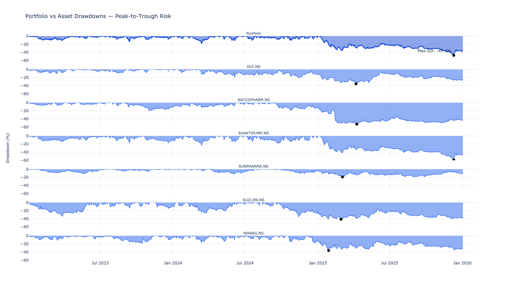
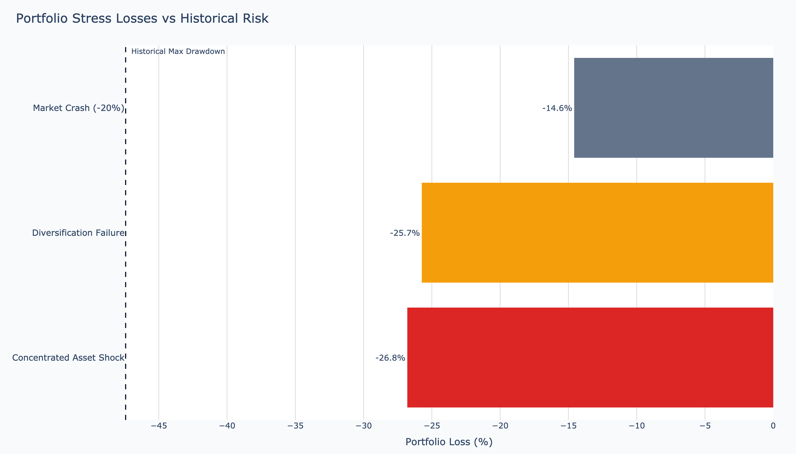
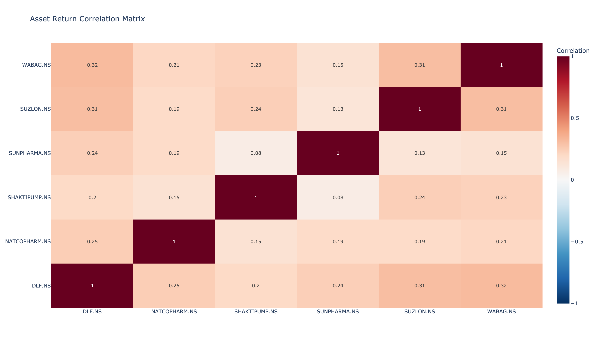
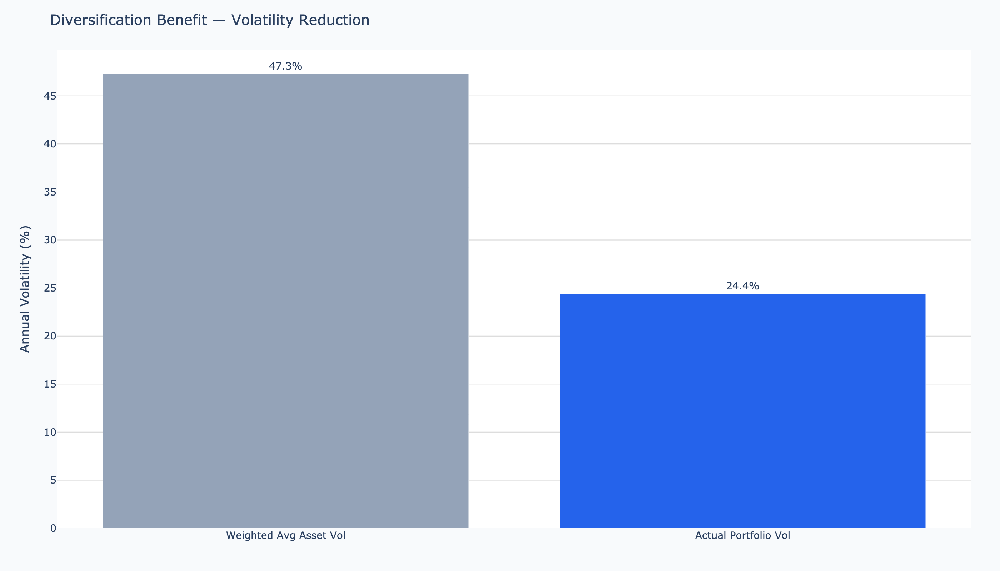

<h1 align="center">FinRisk-Lab</h1>

<p align="center">
  <strong>Portfolio risk & stress-testing in Python.</strong><br/>
  Quantifies downside, diversification failure, and concentration risk for a configurable portfolio — with every assumption made explicit.
</p>

<p align="center">
  
  
  
</p>

<p align="center">
  
</p>

---

## About this project

FinRisk-Lab is a personal project. The goal was to understand portfolio risk well enough to implement every metric from scratch — not to compete with mature libraries.

Established Python tools (`quantstats`, `riskfolio-lib`, `pyportfolioopt`) cover the same surface area more completely, with maintained APIs and a larger feature set. This repo is deliberately not trying to replicate them. It is a from-the-ground-up implementation with three constraints:
- **Every formula is in the code, not a library call.** Sharpe, volatility, drawdown, beta, correlation, risk contribution, diversification benefit — all written out.
- **Every assumption is documented**, in this README and the source.
- **Failures are loud, not silent** — invalid weights, zero variance, or insufficient history raise.

If you want a production risk analytics tool, use `quantstats`. If you want to see what every number in a portfolio risk report actually means, read this repo.

---

## Who this is for

- Junior analysts or students building intuition for portfolio risk math.
- Anyone with a concentrated retail portfolio who wants to see exactly how much risk one position is carrying.
- Reviewers of this README (PM / quant interviewers): the artefact demonstrates the ability to define a problem precisely, implement a measurement system for it, and document the assumptions that constrain interpretation.

---

## The question this answers

> **"How bad can this portfolio get — and why?"**

Most retail and junior-analyst tooling focuses on returns. Volatility, when shown, is presented in isolation. What's typically missing:

- **Concentration risk** — how much of total risk does one position actually carry?
- **Diversification benefit** — what does weighted-average volatility imply, vs. what the portfolio actually delivers?
- **Stress behaviour** — what happens when correlations spike and diversification math breaks?

FinRisk-Lab makes these three questions answerable for any configured portfolio.

---

## Worked example — a deliberately concentrated portfolio

The default configuration in [`config/settings.py`](config/settings.py) is a 6-asset Indian equity portfolio chosen to expose concentration risk:

| Ticker | Weight |
|---|---:|
| SHAKTIPUMP.NS | 67% |
| WABAG.NS | 17% |
| NATCOPHARM.NS | 7% |
| DLF.NS | 3% |
| SUNPHARMA.NS | 3% |
| SUZLON.NS | 3% |

Date range: **Jan 2023 – Jan 2026**. Benchmark: **SENSEX (^BSESN)**.

Running `python -m src.main` against this portfolio produces the numbers below. Full output: [`outputs/results.json`](outputs/results.json).

| Metric | Value | Interpretation |
|---|---:|---|
| Cumulative return | **+702%** | Over 3 years (window total, not annualised) |
| CAGR | **103%** | Annualised compound growth |
| Annual volatility | **24.4%** | Realised σ over the window |
| Max drawdown | **−47.4%** | Worst peak-to-trough an investor would have lived through |
| Diversification benefit | **22.9 ppt** | Weighted-avg asset vol (47.3%) − actual portfolio vol (24.4%) |
| 20% market-crash stress loss | **−14.6%** | Portfolio loss under a uniform −20% market shock (beta-adjusted) |
| SHAKTIPUMP −40% shock loss | **−26.8%** | Portfolio loss if the largest position alone falls 40% |
| Correlation-breakdown vol | **25.7%** | Annualised σ when pairwise correlations are forced to spike |
| **SHAKTIPUMP risk contribution** | **79.7%** | Position holds 67% of weight but 79.7% of total portfolio risk |

The headline: a concentrated portfolio can post triple-digit annualised returns *and* expose the investor to a ~50% drawdown. The point of the engine is to make that asymmetry visible up front, not after the fact.

---

## What the analysis surfaces

### 1. Concentration risk — weight vs. risk contribution

The hero chart (top of README) plots portfolio weight against actual risk contribution. SHAKTIPUMP holds 67% of weight but carries **79.7%** of risk — a 12.7 ppt excess over its weight share, shown in red.

### 2. Drawdown reality — portfolio vs. each asset


The top panel is the portfolio drawdown an investor in this exact basket over this exact window would have realised. Per-asset panels below show that diversification softens — but does not eliminate — the pain when the dominant position drops.

### 3. Stress scenarios — three discrete shocks


Each bar answers a distinct question:
- **Market Crash (−20%)** — what happens if the market index drops 20% and assets fall by their beta?
- **Diversification Failure** — what does annualised σ become if pairwise correlations are scaled 1.5× toward 1?
- **Concentrated Asset Shock** — what happens if the single largest position (SHAKTIPUMP) alone falls 40%?

### 4. Correlation structure


Pairwise return correlations sit in the 0.08 – 0.32 range over this window. Diversification math holds in normal regimes — the stress engine exists because that math fails during real drawdowns.

### 5. Diversification benefit


Weighted-average asset volatility (47.3%) vs. actual portfolio volatility (24.4%). The 22.9 ppt gap is the diversification benefit — meaningful in normal conditions, vulnerable under stress.

---

## What this project is — and is not

**Is:**
- A portfolio risk analytics engine with modular, reusable metrics
- An explainable framework — every assumption is in the code or this README
- A stress-testing harness for "how bad can it get under specific scenarios"

**Is not:**
- A trading strategy or signal generator
- A return-prediction model
- A machine-learning system
- A maintained library (use `quantstats` / `riskfolio-lib` for production use)

---

## Methodology

### Risk metrics computed (per asset and portfolio)

| Metric | Module | Notes |
|---|---|---|
| Daily & log returns | [`src/metrics/returns.py`](src/metrics/returns.py) | Both supported; portfolio aggregation uses simple returns |
| Rolling + annualised volatility | [`src/metrics/volatility.py`](src/metrics/volatility.py) | 21-day rolling window, 252-day annualisation |
| Maximum drawdown | [`src/metrics/drawdown.py`](src/metrics/drawdown.py) | Peak-to-trough on cumulative returns |
| Correlation matrix | [`src/metrics/correlations.py`](src/metrics/correlations.py) | Pearson on daily returns |
| Sharpe ratio | [`src/metrics/sharpe.py`](src/metrics/sharpe.py) | Guarded against zero volatility |
| Beta vs benchmark | [`src/metrics/beta.py`](src/metrics/beta.py) | Covariance(asset, benchmark) / variance(benchmark) |

### Portfolio aggregation

Portfolio risk is *not* a weighted average of asset risk. The engine explicitly models:

- Cumulative return: `(1 + r).prod() - 1` over the window
- CAGR: `cumulative_return^(1 / n_years) − 1`
- Annualised portfolio volatility from the full covariance matrix (not a weighted average of σ)
- Risk contribution per asset (marginal contribution × weight, normalised to sum to 100%)
- Diversification benefit (weighted-avg asset σ − actual portfolio σ, in percentage points)

Single-asset edge case bypasses the diversification math entirely.

### Stress testing

Three deterministic scenarios in [`src/risk_models/stress_engine.py`](src/risk_models/stress_engine.py):

1. **Uniform market shock** — apply a market-level shock (e.g., −20%); each asset loses `β × shock`. Portfolio loss is the weighted sum.
2. **Concentrated asset shock** — shock each asset alone by −40% holding others flat. The chart reports the *worst* single-asset case (which for this portfolio is SHAKTIPUMP → −26.8% portfolio loss).
3. **Correlation breakdown** — scale the correlation matrix by 1.5× (clipped to [−1, 1]) and recompute portfolio σ from the stressed covariance.

These are intentionally not probabilistic. The output is "what is the loss under this specific scenario" — not "what is the probability of this scenario."

---

## Architecture

```
config/settings.py         ── tickers, weights, dates, windows, RFR
        │
        ▼
src/ingestion/             ── yfinance fetch (price history + benchmark)
src/preprocessing/         ── alignment, NaN handling, returns base
src/metrics/               ── returns, volatility, drawdown, correlations, sharpe, beta
src/portfolio/             ── aggregation + risk contribution + diversification benefit
src/risk_models/           ── three stress scenarios
src/visualization/         ── 8 Plotly charts
        │
        ▼
outputs/results.json       ── all numeric metrics
outputs/charts/*.png       ── static chart exports (via generate_charts.py)
```

Each layer is intentionally modular so metrics can be reused independently and failures occur early — invalid weights, insufficient history, or zero variance all raise rather than producing silent garbage.

---

## Assumptions & limitations

Deliberate constraints, not bugs:

- **Historical prices proxy future risk.** Volatility and correlations are backward-looking.
- **No regime-switching.** The engine treats the entire window as a single regime.
- **Stress scenarios are deterministic, not probabilistic.** No VaR/CVaR distribution fitting.
- **No transaction costs, taxes, or liquidity constraints** are modelled.
- **Risk-free rate** defaults to 0 in [`config/settings.py`](config/settings.py) — Sharpe ratios should be interpreted accordingly.
- **Annualisation** uses 252 trading days; not adjusted for Indian market holidays specifically.
- **Single benchmark** (SENSEX) used for beta. Multi-factor beta is out of scope.

---

## Scope status

Feature-complete for the analytical questions it was designed to answer. Possible extensions that are *intentionally out of scope* unless the project picks back up:

- Walk-forward backtesting and rolling stress
- VaR / CVaR distributional estimates (parametric or historical-simulation)
- Monte Carlo stress paths
- Multi-factor beta decomposition
- A dashboard UI

---

## How to run

### Prerequisites
- Python 3.11+
- Internet access (`yfinance` fetches fresh data each run)

### 1. Clone & install
```bash
git clone https://github.com/Rhythmjain12/FinRisk-Lab.git
cd FinRisk-Lab
python -m venv venv && source venv/bin/activate
pip install -r requirements.txt
```

### 2. Configure your portfolio
Edit [`config/settings.py`](config/settings.py):
- `ASSETS` — Yahoo Finance tickers (`RELIANCE.NS`, `AAPL`, etc.)
- `PORTFOLIO_WEIGHTS` — must sum to 1.0; keys must match `ASSETS`
- `START_DATE` / `END_DATE` — analysis window
- `ROLLING_VOL_WINDOW`, `RISK_FREE_RATE`, etc.

### 3. Run the pipeline
```bash
python -m src.main
```
Numeric output → `outputs/results.json`. Interactive Plotly charts open in the browser.

### 4. (Optional) Export charts as static PNGs
```bash
pip install "kaleido==0.2.1"
python generate_charts.py
```
The version pin is intentional: newer `kaleido` releases hit a JSON-serialisation error on `pandas.Timestamp` axis values, so 0.2.1 is the last known-good release for this pipeline.

---

## License

MIT. See [LICENSE](LICENSE) if present.

© 2026 Rhythm Jain.
